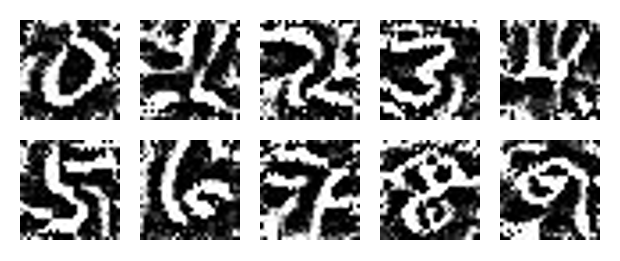

# PyTorch input visualization of a neural network

This repository explores how to visualize what a neural network learned after having trained it.
The basic idea is that we keep the network weights fixed while we run backpropagation on the input image to change the input image to excite our target output the most.

We thus obtain images which are "idealized" versions of our target classes.

For MNIST this is the result of these "idealized" input images that the network likes most for the numbers 0 - 9:

### How to run this?

Run `python mnist.py` to train the MNIST neural network. This saves the model weights as mnist_cnn.pt.
Afterwards, run `python generate_image.py` to loop over the 10 target classes and generate the images in the `generated` folder.

## Blog entry explaining the details

If you want to learn more: check out my blog entry explaining this [visualization technique for deep neural networks](https://www.paepper.com/blog/posts/do-you-know-which-inputs-your-neural-network-likes-most/)
